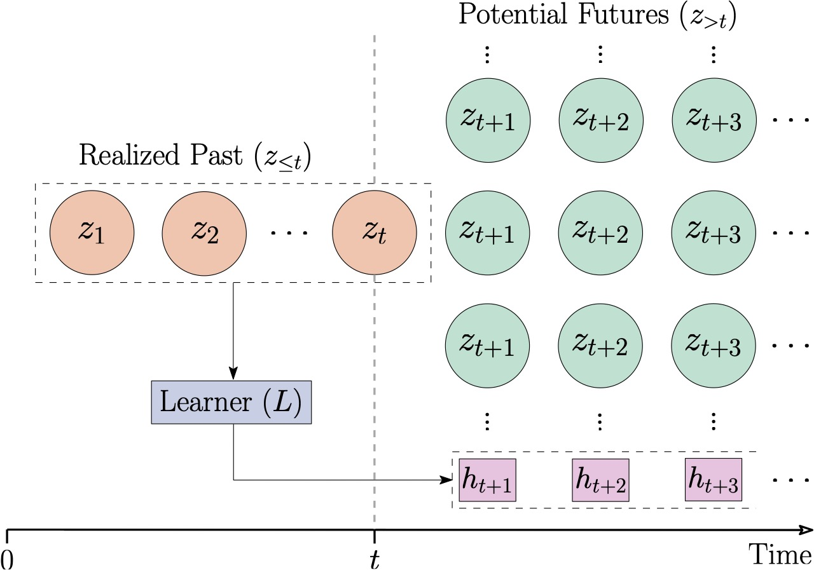

# Prospective Learning: Principled Extrapolation to the Future

## Overview

In real-world applications, the distribution of the data, and our goals, evolve
over time. The prevailing theoretical framework for studying machine learning,
namely probably approximately correct (PAC) learning, largely ignores time. As a
consequence, existing strategies to address the dynamic nature of data and goals
exhibit poor real-world performance. This paper develops a theoretical framework
called "Prospective Learning" that is tailored for situations when the optimal
hypothesis changes over time. In PAC learning, empirical risk minimization (ERM)
is known to be consistent. We develop a learner called Prospective ERM, which
returns a sequence of predictors that make predictions on future data. We prove that
the risk of prospective ERM converges to the Bayes risk under certain assumptions
on the stochastic process generating the data. Prospective ERM, roughly speaking,
incorporates time as an input in addition to the data. We show that standard ERM
as done in PAC learning, without incorporating time, can result in failure to learn
when distributions are dynamic. Numerical experiments illustrate that prospective
ERM can learn synthetic and visual recognition problems constructed from MNIST
and CIFAR-10.

<p align="center">
    
</p>

## Dependencies

* Dependendies: CUDA Toolkit 12.1, pytorch 2.3.0
* Set up the conda environment:

    ```
    conda env create -f environment.yml
    ```

* System requirements:

## Figures

Run the following to generate the results and figures for the binary examples.

```
sh binary/binary_examples.sh
```
